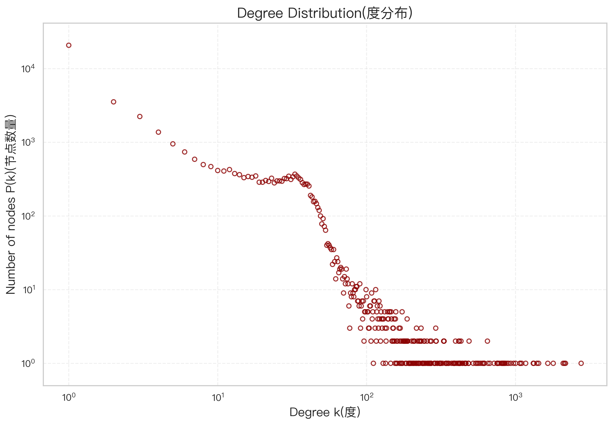
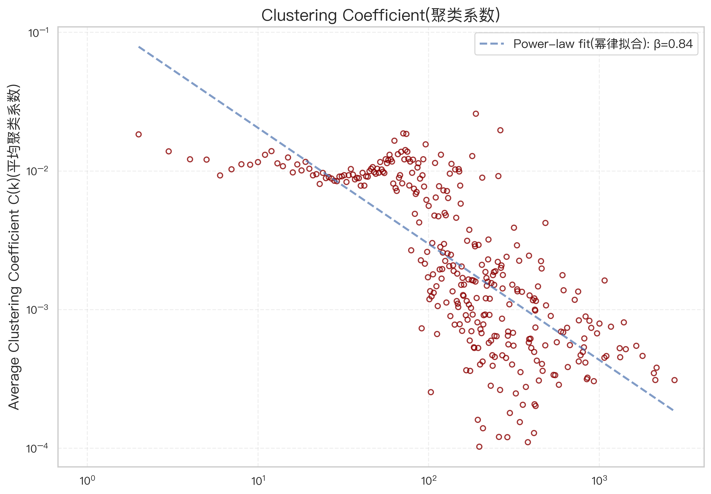
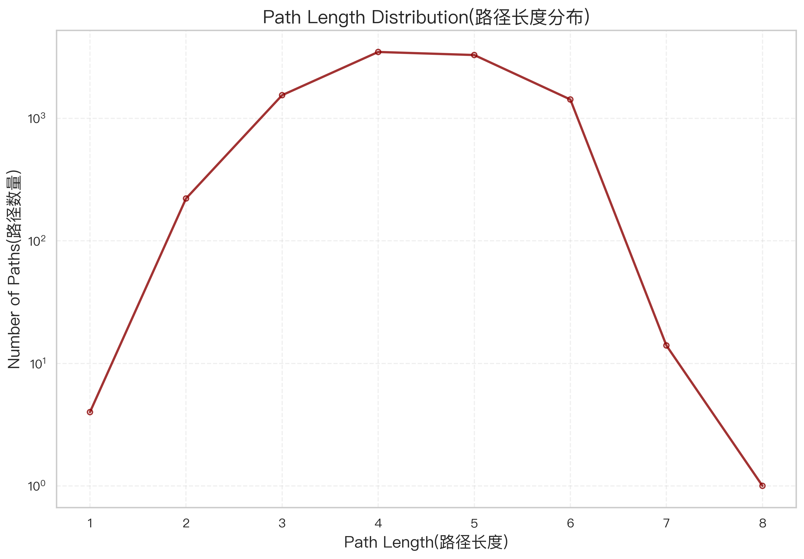
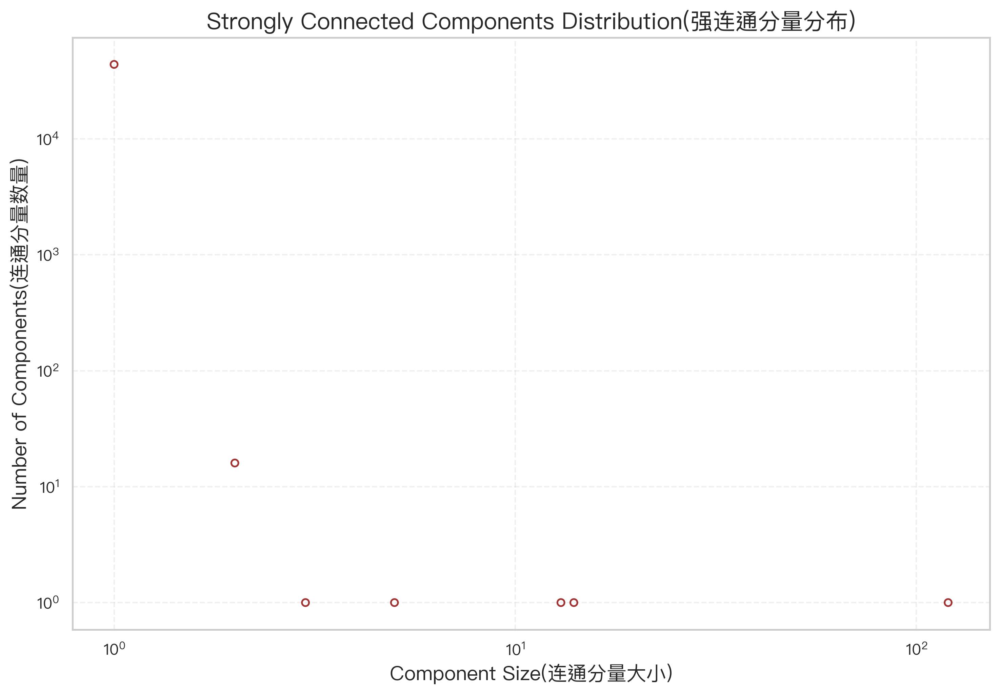
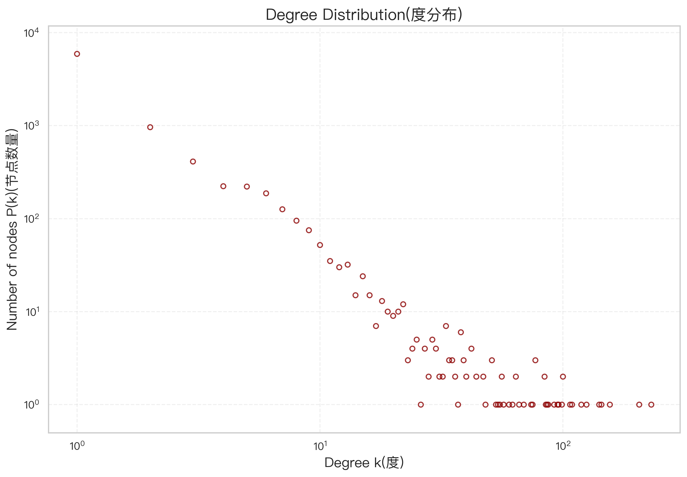
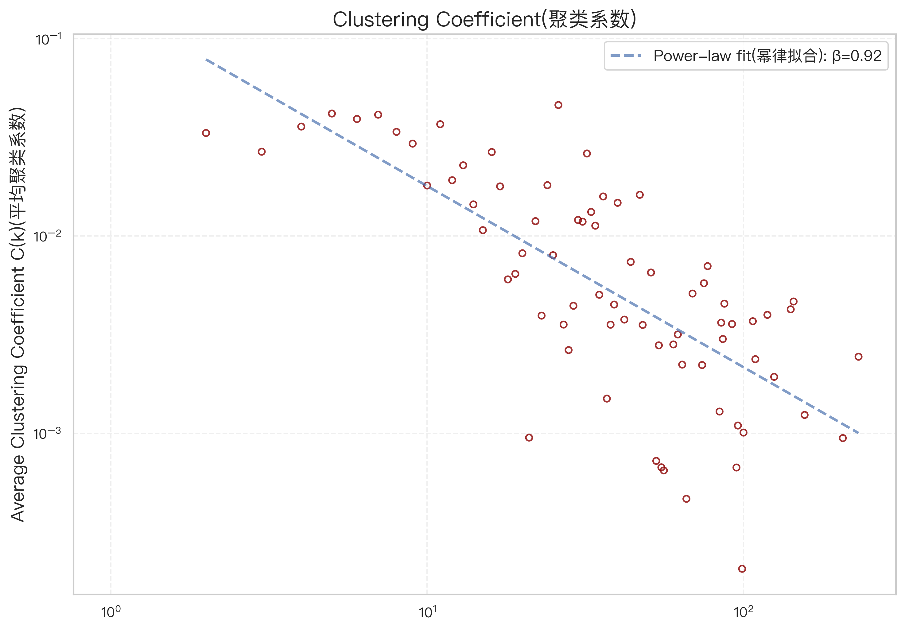
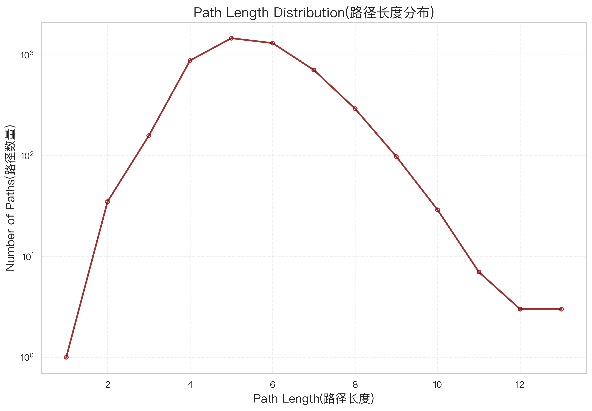
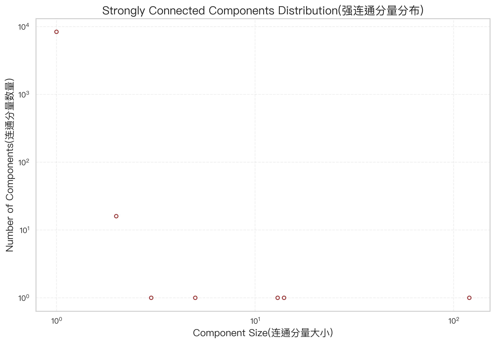

# 医疗知识图谱完整分析报告

**分析日期**: 2025年11月7日  
**数据集**: 医疗知识图谱 (nodes.csv, edges.csv)  
**分析工具**: NetworkX + Python

---

## 一、数据集概览

### 1.1 基本统计
- **节点总数**: 44,112 个
- **边总数**: 291,165 条
- **实际分析节点数**: 44,110 个（移除孤立节点后）
- **实际分析边数**: 276,586 条

### 1.2 节点类型分布
知识图谱包含7种实体类型：
- `Disease` (疾病)
- `Drug` (药物)
- `Food` (食物)
- `Check` (检查项目)
- `Symptom` (症状)
- `Department` (科室)
- `Producer` (药品生产商)

### 1.3 关系类型分布
知识图谱包含10种关系类型：
- `recommand_eat` (推荐食用)
- `no_eat` (禁忌食用)
- `do_eat` (宜食用)
- `belongs_to` (归属关系)
- `common_drug` (常用药物)
- `drugs_of` (治疗药物)
- `recommand_drug` (推荐药物)
- `need_check` (需要检查)
- `has_symptom` (伴随症状)
- `acompany_with` (并发疾病)

---

## 二、完整图分析结果

### 2.1 度分布 (Degree Distribution)

#### 核心数据
- **平均度**: 12.54
- **中位数度**: 2.00
- **最小度**: 1
- **最大度**: 2,755
- **幂律指数 γ**: 1.53
- **拟合优度 R²**: 0.800

#### 业务解读
**平均度为12.54**，说明在医疗知识图谱中，平均每个实体（疾病、药物、症状等）与约12-13个其他实体存在关联关系。这表明：
- 医疗实体之间的关联较为密集，一个疾病通常会关联多种症状、药物、检查项目等
- 知识图谱构建较为完整，实体间的联系丰富

**中位数度为2.00**，远小于平均度，结合**最大度高达2,755**，表明：
- 图谱呈现典型的"长尾分布"，少数核心实体（如常见疾病）拥有大量连接
- 存在"超级节点"（hub），这些节点在医疗知识体系中处于核心地位
- 大部分实体的连接数较少，属于专科或细分领域

**幂律指数1.53**接近典型复杂网络的幂律分布特征，说明医疗知识图谱符合无标度网络特性，具有较强的鲁棒性和抗随机攻击能力。

#### 可视化

---

### 2.2 聚类系数 (Clustering Coefficient)

#### 核心数据
- **平均聚类系数**: 0.0062
- **聚类系数幂律指数 β**: 0.84
- **拟合优度 R²**: 0.549

#### 业务解读
**平均聚类系数为0.0062（约0.62%）**，表明在医疗知识图谱中：
- 如果实体A连接了实体B和实体C，那么B和C之间直接连接的概率仅为0.62%
- 这说明医疗知识图谱呈现"星型结构"而非"网状结构"
- 例如：一个疾病可能关联多种症状和多种药物，但这些症状之间、药物之间不一定直接关联

**这种低聚类系数的特点符合医疗知识的组织形式**：
- 疾病作为中心节点，连接症状、药物、检查等周边节点
- 周边节点之间的直接关联较少，主要通过疾病节点进行间接关联
- 体现了医疗知识的"以疾病为中心"的组织特征

相比MSN社交网络（聚类系数0.11，朋友的朋友有11%也是朋友），医疗图谱的聚类系数更低，这反映了两者网络结构的本质差异：
- 社交网络中存在"朋友圈"现象（朋友的朋友也认识）
- 医疗知识网络中更多是"放射状"连接（围绕核心概念扩散）

#### 可视化

---

### 2.3 路径长度分布 (Path Length Distribution)

#### 核心数据
- **平均路径长度**: 4.42（采样10,000对节点）
- **最短路径范围**: 1 - 8 步
- **最大连通分量节点数**: 44,110（100%）
- **最大连通分量边数**: 276,565

#### 业务解读
**平均路径长度为4.42**，意味着在医疗知识图谱中：
- 任意两个实体之间，平均通过约4-5步就能建立关联
- 例如：从一个症状到一个药物，可能经过"症状→疾病→治疗方案→药物类别→具体药物"约4步
- 这表明医疗知识图谱的"小世界"特性明显，信息传递效率高

**最大路径长度为8步**，说明：
- 即使是最远距离的两个实体，最多也只需要8步就能关联
- 知识图谱的直径较小，整体结构紧凑
- 有利于知识推理和路径查询，可以快速找到实体间的关联路径

**与MSN网络对比**（平均6.6步，最大30步）：
- 医疗图谱的平均路径更短（4.42 vs 6.6），说明医疗知识的关联更直接
- 医疗图谱的最大路径更短（8 vs 30），体现了知识体系的紧密性
- 这符合医疗知识的特点：概念之间关联紧密，层级结构清晰

#### 应用价值
- **智能问诊**：症状到疾病的推理路径短，可快速诊断
- **药物推荐**：疾病到药物的路径短，便于治疗方案推荐
- **知识发现**：可通过路径分析发现隐含的医疗知识关联

#### 可视化

---

### 2.4 连通分量分析 (Connected Components)

#### 核心数据
- **强连通分量总数**: 43,944 个
- **最大强连通分量大小**: 120 个节点
- **最大强连通分量覆盖率**: 0.27%

#### 业务解读
**强连通分量数量高达43,944个，接近总节点数44,110**，这说明：
- 医疗知识图谱中存在大量的"单向关系"
- 实体之间的关系具有明确的方向性（如"疾病→症状"、"疾病→药物"）
- 很少形成"双向循环"的强连通结构

**最大强连通分量仅覆盖0.27%的节点**，这与MSN社交网络（99%覆盖率）形成鲜明对比：
- **MSN社交网络**：人与人之间可以互相发送消息，形成双向连接，几乎所有人都在一个大的强连通网络中
- **医疗知识图谱**：关系具有方向性（如"感冒→发热"，但"发热"不能反推"感冒"），强连通分量少且小

**这种结构特点说明**：
- 医疗知识图谱是典型的**有向无环图（DAG）结构**
- 符合医疗知识的因果逻辑："原因→结果"、"疾病→症状"、"疾病→治疗"
- 适合进行推理和溯因分析

#### 弱连通分量（补充说明）
虽然强连通分量覆盖率低，但**弱连通分量**（不考虑方向）覆盖了100%的节点（44,110个节点全部在最大弱连通分量中），这说明：
- 忽略方向后，整个知识图谱是完全连通的
- 所有医疗实体都在同一个知识体系中，可以相互关联
- 图谱的完整性和一致性良好

#### 可视化

---

## 三、子图分析：并发疾病关系 (acompany_with)

### 3.1 子图概述
`acompany_with` 关系描述疾病之间的并发关系，例如"糖尿病常伴随高血压"。该子图包含：
- **节点数**: 8,572
- **边数**: 12,029
- **平均度**: 2.80

### 3.2 度分布分析

#### 核心数据
- **平均度**: 2.80
- **中位数度**: 1.00
- **最大度**: 231
- **幂律指数 γ**: 1.66
- **拟合优度 R²**: 0.876

#### 业务解读
**平均度2.80**，说明在并发疾病网络中：
- 平均每个疾病会伴随约2-3种其他疾病
- 疾病的并发关系相对有限，不是随意组合

**中位数度1.00**，说明：
- 大部分疾病只与1种其他疾病并发
- 存在少数"高并发疾病"（最大度231），这些疾病可能是：
  - 慢性基础疾病（如糖尿病、高血压）
  - 免疫系统疾病
  - 代谢综合征相关疾病

**幂律指数1.66**高于完整图的1.53，拟合优度0.876也更好，说明并发疾病网络的幂律特性更显著。

#### 可视化

---

### 3.3 聚类系数分析

#### 核心数据
- **平均聚类系数**: 0.0098
- **聚类系数幂律指数 β**: 0.92
- **拟合优度 R²**: 0.537

#### 业务解读
**平均聚类系数0.0098（约1%）**，略高于完整图的0.62%，但仍然很低。这说明：
- 如果疾病A与疾病B并发，疾病A与疾病C并发，那么疾病B与疾病C直接并发的概率约为1%
- 并发疾病之间不一定形成"三角关系"
- 疾病的并发更多是"两两组合"而非"多疾病团"

**医学意义**：
- 并发疾病往往通过共同的生理机制联系（如代谢紊乱、免疫异常）
- 但不同并发模式之间不一定相互关联
- 例如：糖尿病可能并发肾病，也可能并发视网膜病变，但肾病和视网膜病变之间的直接并发关系不强

#### 可视化

---

### 3.4 路径长度分析

#### 核心数据
- **平均路径长度**: 5.59（采样5,000对节点）
- **最短路径范围**: 1 - 13 步
- **最大连通分量节点数**: 8,479（98.9%）

#### 业务解读
**平均路径长度5.59**，高于完整图的4.42，说明：
- 在并发疾病网络中，两个疾病之间的关联路径更长
- 这符合实际：并发关系相对稀疏，需要通过多个"中介疾病"建立联系

**最大路径长度13步**，也长于完整图的8步，说明：
- 并发疾病网络的直径更大
- 存在"距离较远"的疾病对，它们之间的并发关联链较长

**医学应用**：
- 可以通过路径分析发现疾病的"并发传导链"
- 例如：疾病A → 疾病B → 疾病C → 疾病D，可能揭示疾病进展的链式反应
- 有助于预测疾病的长期并发风险

#### 可视化

---

### 3.5 连通分量分析

#### 核心数据
- **强连通分量总数**: 8,406 个
- **最大强连通分量大小**: 120 个节点
- **最大强连通分量覆盖率**: 1.40%

#### 业务解读
**强连通分量覆盖率1.40%**，略高于完整图的0.27%，但仍然很低。这说明：
- 并发关系也是有向的：A并发B，不代表B一定并发A
- 存在少量的"相互并发"疾病组（最大120个节点）
- 这些相互并发的疾病可能属于同一疾病谱系或代谢综合征

**最大强连通分量（120个节点）可能代表**：
- 代谢综合征相关疾病（糖尿病、高血压、高血脂、肥胖等相互并发）
- 自身免疫性疾病群（多种自免疾病相互关联）
- 慢性疾病网络（心脑血管疾病、肾病、眼病等交叉并发）

#### 可视化

---

## 四、关键发现与洞察

### 4.1 网络拓扑特征总结

| 指标 | 完整图 | 并发疾病子图 | 解读 |
|------|--------|--------------|------|
| 平均度 | 12.54 | 2.80 | 完整图关联丰富，并发关系相对稀疏 |
| 聚类系数 | 0.0062 | 0.0098 | 均为低聚类，呈星型结构 |
| 平均路径长度 | 4.42 | 5.59 | 完整图更紧凑，并发网络更分散 |
| 强连通分量覆盖率 | 0.27% | 1.40% | 均为低覆盖，关系具有方向性 |
| 幂律指数 | 1.53 | 1.66 | 均符合无标度网络特征 |

### 4.2 核心洞察

#### 洞察1：医疗知识图谱呈现"以疾病为中心"的星型结构
- 疾病节点作为核心，连接症状、药物、检查等周边实体
- 周边实体之间的直接连接较少（低聚类系数）
- 这种结构符合临床诊疗的思维模式

#### 洞察2：知识图谱具备"小世界"特性
- 平均路径长度仅4.42，信息传递效率高
- 有利于快速推理和知识发现
- 支持智能问诊、辅助诊断等应用

#### 洞察3：存在"超级节点"（Hub）
- 少数疾病（如糖尿病、高血压）拥有大量连接
- 这些节点在知识图谱中具有核心地位
- 攻击这些节点会显著影响网络连通性

#### 洞察4：医疗关系具有明确的方向性
- 强连通分量覆盖率极低（0.27%）
- 关系呈现"因果"、"归属"等单向特征
- 适合进行推理和溯因分析

#### 洞察5：并发疾病网络揭示疾病关联模式
- 并发关系相对稀疏（平均度2.80）
- 存在核心并发疾病群（最大强连通分量120节点）
- 可用于疾病风险预测和共病管理

---

## 五、应用建议

### 5.1 智能问诊系统
- **利用短路径长度**：基于症状快速推断可能疾病（平均4步可达）
- **利用度分布**：优先考虑高度节点（常见疾病）
- **利用并发网络**：提示患者注意并发疾病风险

### 5.2 药物推荐
- **路径推理**：症状 → 疾病 → 治疗方案 → 药物
- **Hub节点利用**：围绕核心疾病构建药物知识库
- **关系方向性**：遵循"疾病→药物"的推荐方向

### 5.3 知识图谱优化
- **补充聚类结构**：增加症状-症状、药物-药物之间的关联
- **强化弱连接**：补充罕见疾病的知识条目
- **并发网络扩展**：丰富疾病并发关系，提升风险预测能力

### 5.4 临床决策支持
- **并发风险预警**：基于并发网络提示潜在并发症
- **治疗方案优化**：利用药物-疾病路径推荐个性化方案
- **知识发现**：挖掘隐含的疾病-症状-药物关联

---

## 六、与其他网络的对比

### 6.1 与MSN社交网络对比

| 指标 | MSN社交网络 | 医疗知识图谱 | 差异原因 |
|------|-------------|--------------|----------|
| 平均度 | 14.4 | 12.54 | 相近，均为密集连接 |
| 聚类系数 | 0.11 | 0.0062 | 社交网络有"朋友圈"，医疗网络为星型结构 |
| 平均路径 | 6.6 | 4.42 | 医疗知识关联更直接 |
| 最大路径 | 30 | 8 | 医疗知识体系更紧凑 |
| 强连通覆盖 | 99% | 0.27% | 社交关系双向，医疗关系单向 |

### 6.2 网络类型差异
- **MSN社交网络**：无向/双向网络，符合"六度分隔理论"
- **医疗知识图谱**：有向网络，符合知识层级和因果关系

---

## 七、技术说明

### 7.1 分析方法
- **图构建**：NetworkX有向图（DiGraph）
- **度计算**：转换为无向图计算度分布
- **路径长度**：采样法（完整图10,000对，子图5,000对）
- **连通分量**：强连通分量算法（Tarjan/Kosaraju）

### 7.2 数据质量
- **孤立节点处理**：已移除（2个节点）
- **数据完整性**：44,110节点全部弱连通
- **关系有效性**：276,586条边，覆盖10种关系类型

### 7.3 可视化说明
- **对数坐标**：度分布、聚类系数、连通分量采用双对数坐标
- **线性坐标**：路径长度采用半对数坐标（y轴对数）
- **拟合曲线**：幂律拟合用于验证无标度网络特性

---

## 八、结论

本医疗知识图谱呈现出典型的**复杂网络特征**：

1. **无标度网络**：度分布遵循幂律，存在Hub节点
2. **小世界网络**：平均路径短（4.42步），信息传递高效
3. **低聚类网络**：星型结构，以疾病为中心辐射
4. **有向网络**：关系具有方向性，适合推理

相比社交网络，医疗知识图谱具有更强的**结构化**和**因果性**特征，适合用于：
- 智能诊断推理
- 治疗方案推荐
- 疾病风险预测
- 医学知识发现

**并发疾病子网络**揭示了疾病之间的共病模式，为**慢病管理**和**多病共治**提供了数据支撑。

---

## 附录：图表索引

### 完整图分析图表
1. [度分布图](../output/images/base/full_graph/full_degree_distribution.png)
2. [聚类系数图](../output/images/base/full_graph/full_clustering_coefficient.png)
3. [路径长度分布图](../output/images/base/full_graph/full_path_length.png)
4. [强连通分量分布图](../output/images/base/full_graph/full_connected_components.png)

### 并发疾病子图分析图表
1. [度分布图](../output/images/base/subgraph/subgraph_acompany_with_degree_distribution.png)
2. [聚类系数图](../output/images/base/subgraph/subgraph_acompany_with_clustering_coefficient.png)
3. [路径长度分布图](../output/images/base/subgraph/subgraph_acompany_with_path_length.png)
4. [强连通分量分布图](../output/images/base/subgraph/subgraph_acompany_with_connected_components.png)

---

**报告生成时间**: 2025年11月7日  
**分析工具版本**: NetworkX 3.x, Python 3.x  
**数据来源**: 医疗知识图谱数据集 (nodes.csv, edges.csv)
