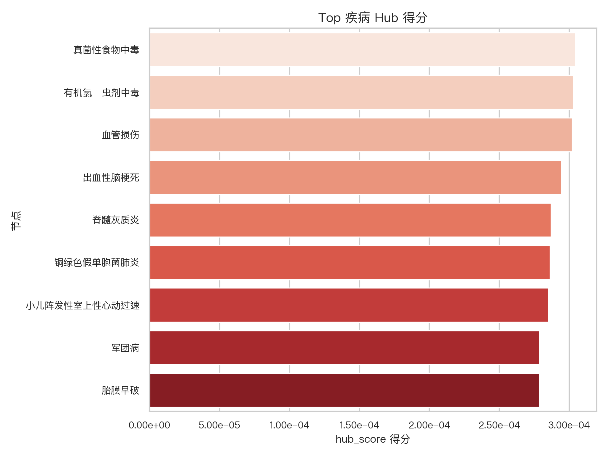
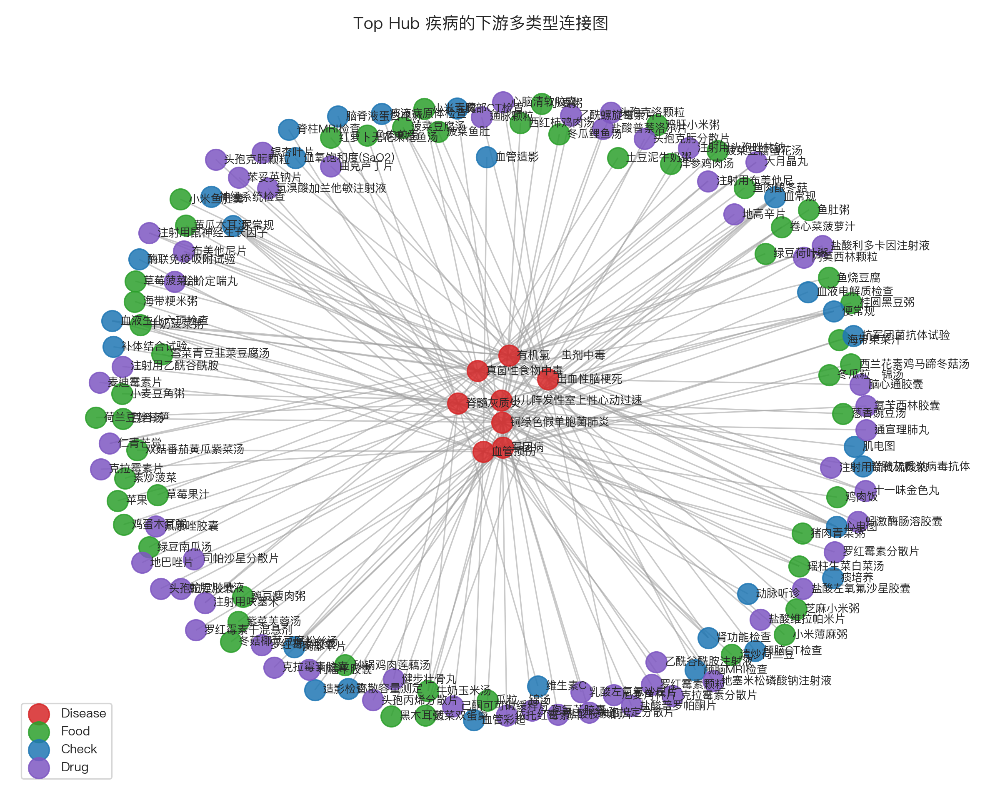
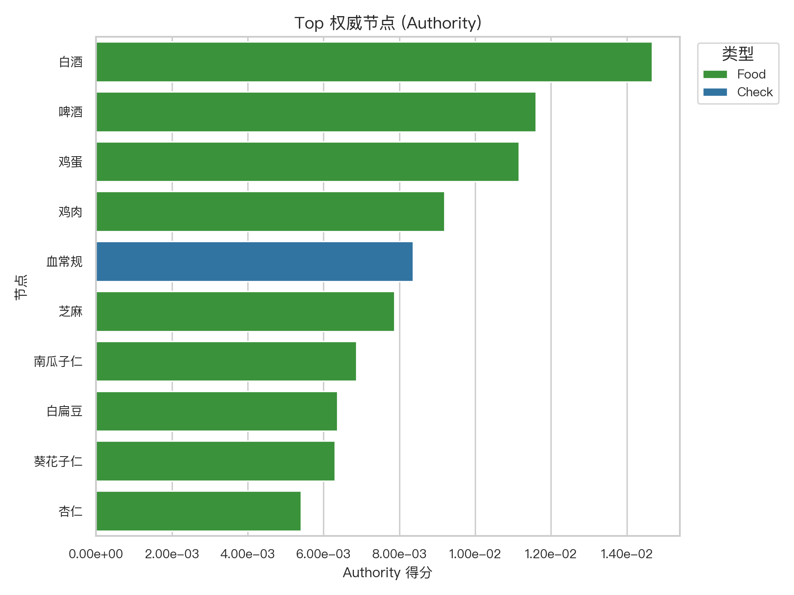
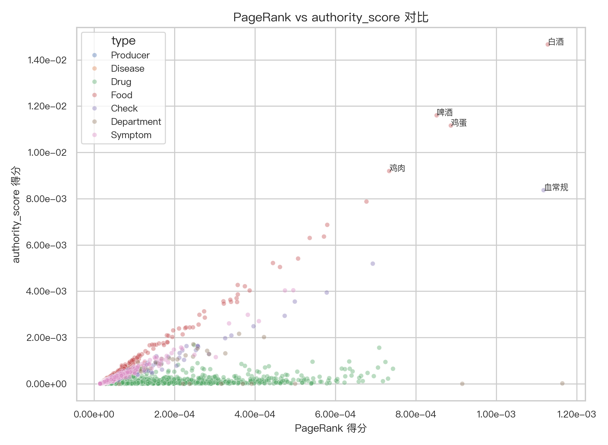

# 医疗知识图谱 HITS (Hub/Authority) 分析报告

**分析日期**: 2025年11月10日  
**数据集**: 医疗知识图谱 (节点: 44,112)
**分析工具**: NetworkX + Python

---

## 一、HITS 算法概览

HITS (Hyperlink-Induced Topic Search) 是一种衡量节点在网络中重要性的算法，它将节点的重要性分为两个维度：
- **Hub (枢纽) Score**: 指向大量高质量 Authority 页面的节点，其 Hub 分数会更高。在医疗图谱中，高 Hub 节点通常是“信息分发中心”，如复杂疾病，它们关联多种药物、检查和症状。
- **Authority (权威) Score**: 被大量高质量 Hub 页面指向的节点，其 Authority 分数会更高。在医疗图谱中，高 Authority 节点通常是“公认的优质资源”，如特效药、关键检查手段或典型症状。

### 1.1 核心数据
- **节点总数**: 44,112
- **平均 Hub 分数**: 2.27e-05
- **平均 Authority 分数**: 2.27e-05

---

## 二、Hub (枢纽) 分析

### 2.1 Top 10 枢纽疾病 (Hub Score)

#### 业务解读
Hub 分数衡量一个节点指向其他“权威”节点的能力。在医疗领域，高 Hub 分数的疾病通常是**复杂性高、涉及多系统、需要多种手段干预**的疾病。

**数据观察**：
上图展示了 Hub 分数最高的10个疾病，例如 **真菌性食物中毒**、**有机氯杀虫剂中毒** 和 **血管损伤**。这些疾病的共同特点是：
- **诊疗路径复杂**：它们通常不是单一病因或单一疗法能解决的，需要关联多种药物、检查、饮食建议甚至并发症管理。
- **信息枢纽价值高**：在构建临床决策支持系统或患者教育内容时，这些疾病是天然的“入口”，可以引导用户探索相关的多方面知识。

**应用建议**：
- **智能导诊入口**：可将这些高 Hub 疾病作为智能导诊的优先推荐入口，因为它们覆盖的下游知识范围更广。
- **内容专题策划**：围绕这些疾病制作深度科普内容（如“一文读懂XXX”），能够有效组织和串联大量相关医疗知识。

### 2.2 Top Hub 疾病的下游网络

#### 业务解读
为了进一步理解 Top Hub 疾病的“枢纽”特性，我们构建了其下游关联网络。该网络包含 **8** 个核心疾病节点，连接了 **136** 个下游资源节点（药物、食品、检查），共计 **179** 条连接。

**结构洞察**：
- **资源多样性**：从图中可以看出，一个高 Hub 疾病（如中心位置的红色节点）会同时连接多种颜色（代表不同类型）的下游节点，这直观地展示了其诊疗的“多模态”特性。
- **连接密度**：某些疾病周围的下游节点非常密集，表明其治疗和管理方案标准化程度高、选择多。而连接稀疏的区域可能代表这是一个研究较少或治疗方案有限的领域。

**应用建议**：
- **构建“疾病画像”**：该网络结构是构建“疾病知识卡片”或“疾病画像”的绝佳数据基础，能全面展示与某一疾病相关的所有核心信息。
- **发现知识缺口**：如果一个常见复杂疾病在图中的下游连接（如“推荐药物”或“必要检查”）非常稀疏，这可能指示了知识库中存在内容缺口，需要优先补充。

---

## 三、Authority (权威) 分析

### 3.1 Top 10 权威节点 (Authority Score)

#### 业务解读
Authority 分数衡量一个节点被多少“枢纽”节点指向。在医疗领域，高 Authority 分数的节点通常是**被广泛引用和推荐的核心资源**。

**数据观察**：
上图展示了 Authority 分数最高的10个节点。我们发现，这些节点类型多样，包括 **Food** (如“白酒”) 和 **Food** (如“啤酒”)。
- **通用性与关键性**：高 Authority 节点往往是多种疾病诊疗路径上的“共同终点”。例如，某个检查项目被多种复杂疾病作为关键诊断依据，或者某种药物是多种疾病的常规治疗选择。
- **“黄金标准”资源**：这些节点可以被视为医疗知识库中的“黄金标准”或“高价值”资源，因为它们被最多的上游复杂场景所需要。

**应用建议**：
- **知识库质量提升**：应优先确保这些高 Authority 节点的知识描述最准确、最详尽，因为它们被引用的频率最高。
- **搜索与推荐优化**：在搜索引擎中，可以为这些节点赋予更高权重。在推荐系统中，它们可以作为“明星资源”优先展示。

---

## 四、HITS 与 PageRank 对比分析

#### 业务解读
PageRank 衡量全局的重要性（被越多、越重要的节点指向，得分越高），而 Authority 衡量作为“权威资源”被“枢纽”指向的程度。对比两者可以发现不同类型的核心节点。

**象限分析**：
- **高 Authority / 高 PageRank (右上)**：图谱中的“超级明星”。它们既是全局的核心（PageRank高），也是特定领域的权威资源（Authority高）。这些是知识库中最关键的节点。
- **高 Authority / 低 PageRank (左上)**：专业的“领域权威”。它们可能不是全局热点，但在特定复杂场景下是不可或缺的关键资源。例如，一种罕见病的特效药或特定手术的关键检查。
- **低 Authority / 高 PageRank (右下)**：重要的“连接者”或“基础概念”。它们在全图中连接广泛，但并非被复杂疾病集中引用的“最终答案”。

**应用建议**：
- **差异化运营**：“超级明星”节点适合大众科普和广泛推荐。“领域权威”节点适合用于专家系统和垂直领域的深度内容建设。

---

## 五、关键发现与洞察

1. **识别核心疾病**：HITS 的 Hub 分数成功识别了一批诊疗路径复杂、涉及多学科的“枢纽疾病”，它们是知识图谱中的关键入口。
2. **发现权威资源**：Authority 分数有效挖掘出被多种复杂疾病共同依赖的“黄金标准”资源，如关键检查和通用药物。
3. **揭示网络结构**：Hub-Authority 结构清晰地展示了医疗知识“从疾病到资源”的放射状关联模式，与 `graph_analysis` 中发现的星型结构一致。
4. **补充全局视角**：与 PageRank 的对比分析，为我们提供了更丰富的节点角色定义，区分了“全局明星”与“领域专家”，有助于实施更精细化的运营策略。

---

## 六、应用建议

- **智能导诊优化**：利用 Top Hub 疾病作为导诊的起点，并根据其下游网络构建多轮问答与推荐逻辑。
- **内容质量与优先级**：优先审核和丰富 Top Authority 节点的内容，确保这些最高频被引用的知识准确无误。
- **个性化推荐**：结合 Hub 和 Authority 分析，可以为用户构建“从症状/疾病（Hub）到推荐方案（Authority）”的个性化知识路径。
- **知识图谱补全**：分析低 Hub 或低 Authority 的区域，识别知识覆盖的薄弱环节，并指导数据补充和知识挖掘的方向。