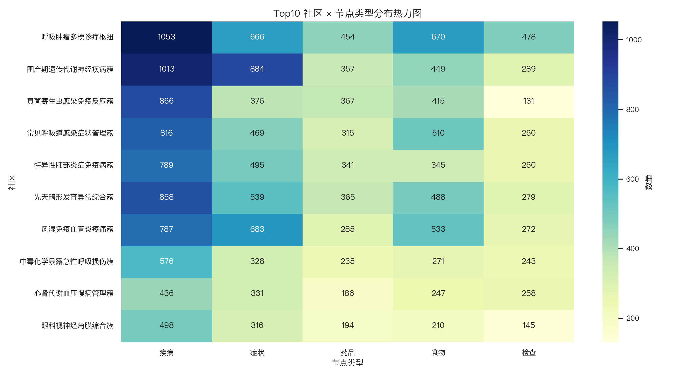

# Louvain 社区发现分析报告

**分析日期**: 2025年11月10日  
**数据集**: 医疗知识图谱 (社群化分析)
**分析工具**: NetworkX + Python-Louvain

---

## 一、Louvain 社区发现算法概览

Louvain 算法是一种高效的社区发现算法，用于揭示网络中的“社群”结构。在医疗知识图谱中，一个“社区”可以被理解为一组在功能上或临床上紧密相关的医疗实体（如疾病、症状、药物）的集合。
该算法通过优化“模块度”（Modularity）指标来找到最佳的社区划分。模块度越高，意味着社区内部的连接远比社区之间的连接更密集，社群结构也越明显。

### 1.1 核心数据
- **检测到的社区总数**: 47
- **网络模块度 (Modularity)**: 0.4547
- **最大社区规模**: 5,195

#### 业务解读
**模块度为 0.4547**，这是一个相对较高的值（通常 > 0.3 即认为网络有显著的社区结构），表明我们的医疗知识图谱并非杂乱无章，而是可以被清晰地划分为多个高内聚的“主题簇”或“功能模块”。
**检测到 47 个社区**，说明医疗知识体系可以被细分为数千个不同的专业领域或疾病系统。这符合医学知识高度专业化和模块化的特点。

---

## 二、Top 10 社区结构分析

### 2.1 Top 10 社区节点类型分布

#### 业务解读
上图的热力图展示了规模最大的10个社区内部的节点类型构成。每一行代表一个社区，每一列代表一种节点类型（如疾病、药物）。

**结构洞察**：
- **社区主题识别**：通过观察每行中颜色最深的单元格，可以快速判断一个社区的主题。例如，如果“疾病”和“症状”列的数值远高于其他列，那么这个社区很可能是一个“**疾病-症状**”主题群。
- **社区功能区分**：
  - **诊疗型社区**：通常包含大量的“疾病”、“症状”、“药物”和“检查”节点，形成一个完整的诊疗知识闭环。
  - **预防/康复型社区**：可能以“疾病”和“食物”节点为主，侧重于生活方式和饮食干预。
  - **药物专题社区**：可能由“药物”、“生产商”和相关的“疾病”构成，侧重于药理知识。

**应用建议**：
- **知识导航**：可以基于这些社区主题构建分层级的知识导航系统，帮助用户在特定医学领域内进行探索。
- **内容聚合**：自动将同一社区内的知识点聚合起来，形成专题页面或知识卡片，提升用户体验。

### 2.2 Top 10 社区簇粒子图

#### 业务解读
这张图将规模最大的10个社区可视化为独立的“粒子簇”，直观地展示了它们内部的结构和外部的联系。

**结构洞察**：
- **社区内部结构**：每个半透明区域代表一个社区。区域内节点的密集程度和连接方式反映了该社区的内部结构。例如，某些社区可能有一个或多个核心节点，而其他社区的结构则更为分散。
- **社区间关联**：连接不同社区的灰色细线代表“跨界知识”。这些连接虽然稀疏，但非常重要，它们揭示了不同医学领域之间的交叉点。例如，连接“心血管社区”和“内分泌社区”的边可能代表糖尿病与心脏病的并发关系。
- **节点角色**：图中不同颜色的粒子代表不同类型的节点。我们可以观察到，某些社区（如诊疗型社区）内部颜色丰富，而另一些则颜色单一（如纯粹的药物社区）。

**应用建议**：
- **发现交叉学科研究点**：重点分析连接两个或多个社区的“桥梁节点”，这些节点可能是多学科交叉研究的关键。
- **构建智能推荐引擎**：当用户浏览一个社区的知识时，可以沿着跨社区的连接向其推荐其他相关社区的内容，实现“知识漫游”。

---

## 三、关键发现与洞察

1. **知识的高度模块化**：高模块度（{modularity:.4f}）证明了医疗知识图谱可以被成功分解为多个高内聚、低耦合的知识模块，这为知识管理和应用提供了极大的便利。
2. **社区主题的多样性**：通过对 Top 10 社区的分析，我们识别出多种主题的社区，如“疾病-症状”群、“疾病-药物”群等，揭示了知识图谱内部丰富的功能分区。
3. **领域交叉点的识别**：社区间的连接虽然稀疏，但精确地标识了不同医学领域（如心血管与内分泌）之间的重要关联，为发现隐藏知识和促进多学科协作提供了线索。

---

## 四、应用建议

- **构建分层知识图谱**：将社区作为更高层次的“概念节点”，构建一个“社区-实体”的两层知识图谱，简化宏观分析和导航。
- **个性化学习路径**：根据用户的兴趣和背景，为他们规划穿越不同社区的个性化学习路径，例如从一个“症状社区”出发，深入到一个“疾病社区”，再关联到“药物社区”。
- **专家知识挖掘**：识别那些专注于特定颜色（节点类型）的社区，可以帮助我们定位特定领域的专家知识集合，例如，一个几乎全由“药物”和“生产商”组成的社区，可能是一个专业的药理知识库。