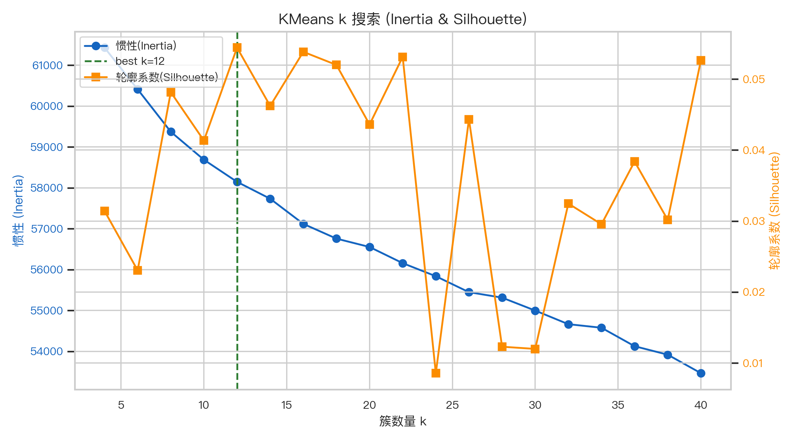
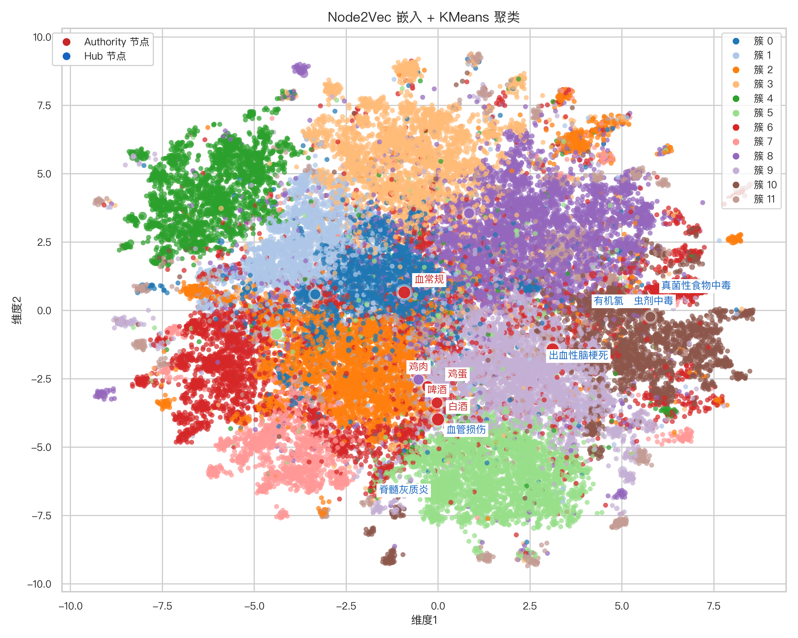
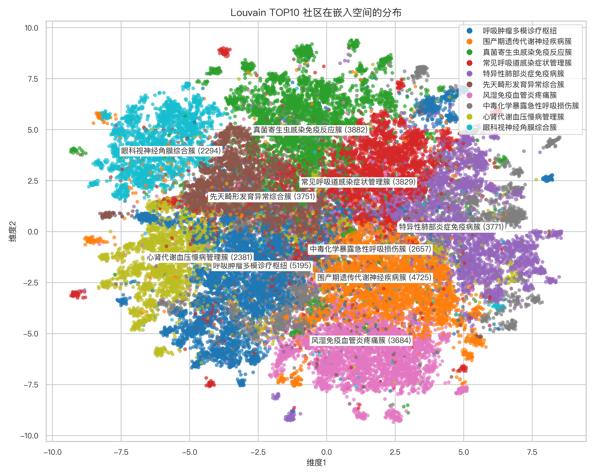

# Node2Vec 嵌入可视化分析

**分析日期**：2025年11月17日  
**嵌入维度**：128  
**有效节点**：44,110

## 1. 训练配置与性能

- 随机游走：长度 80，每节点 10 次，(p=0.25, q=1.00)
- Word2Vec：window=10，epochs=20，workers=13
- 时间开销：随机游走 135.71s + 训练 481.83s = 总计 617.55s，tokens/s ≈ 73,237
- 全图 44,110 个节点均生成嵌入（missing=0），累计 441,100 条游走 / 35,288,000 tokens，为后续的聚类与可视化提供一致输入。

## 2. KMeans 最佳 k 搜索

- 蓝色惯性曲线随着 k 增大持续下降，而橙色 Silhouette 在 k=12 时达到 0.054 的峰值，说明 12 个簇在紧密度与可分性之间取得最佳平衡。
- 扫描的 k 范围：4, 6, 8, 10, 12, 14, 16, 18, 20, 22, 24, 26, 28, 30, 32, 34, 36, 38, 40。k≥20 时轮廓系数明显回落，对应图中橙线的波谷，提示继续细分只会把连贯语义割裂成噪声。

## 3. KMeans vs Louvain TOP10

- 表格展示 TOP10 Louvain 社区与 KMeans 簇的重叠，主对角线出现 80%+ 的亮块，峰值对齐 91.0% ，说明随机游走嵌入与社区检测在宏观主题上高度一致。
- 次要块状区域（如免疫/风湿相关社区）同时覆盖多个簇，提示这些主题在语义空间更分散，可作为后续细分或跨簇关系挖掘的候选。

## 4. 嵌入投影 + KMeans 簇

- 可视化节点：36,169，采用 UMAP 将 128 维嵌入降至 2D；点颜色完全来自 KMeans 簇，点尺寸代表 PageRank/度数。
- PageRank Top5（内科, 白酒, 血常规, 外科, 鸡蛋）呈现“两类典型位置”：(1) 内科、血常规位于各自簇的几何中心；(2) 白酒、鸡蛋位于多个簇的交界带，外科介于相邻簇的带状过渡区——这些边界型高 PageRank 节点通常承担跨语义连结。
- Authority（红色标签）与 Hub（蓝色标签）的空间分布：Authority 中“白酒、啤酒、鸡蛋、鸡肉”沿簇边界成带状分布，而“血常规”是唯一位于簇内部的红点；Hub 中“血管损伤”与前述红点共同落在同一条簇的交界线，其他 Hub 则呈“中心型 + 边界型”并存。
- 白色光环标注的 PageRank Top10 与红/蓝角色标签叠加后，可以快速圈定“既重要又具跨簇影响力”的锚点实体，用于问答/检索召回与知识推理起点。

## 5. Louvain TOP10 空间分布

- 每个社区在 2D 投影中呈椭圆状密度块，白底标签标注主题，便于与上一幅 KMeans 彩色块逐一对照。
- Louvain 块与 KMeans 色块在空间位置高度一致：这意味着基于随机游走学习到的嵌入，在降维后仍较好地保留了社区结构；当两图中的块彼此靠近（如围产期遗传 vs 先天畸形）时，可认为它们在知识图谱中语义更相近。

---

这些图表联合展示了随机游走 + 嵌入在宏观（社区）与微观（PageRank/HITS）层面的互补性，可据此挑选重点节点、验证主题划分，或进一步做相似度检索与知识推理。