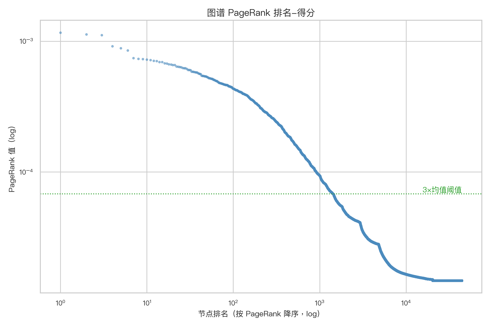
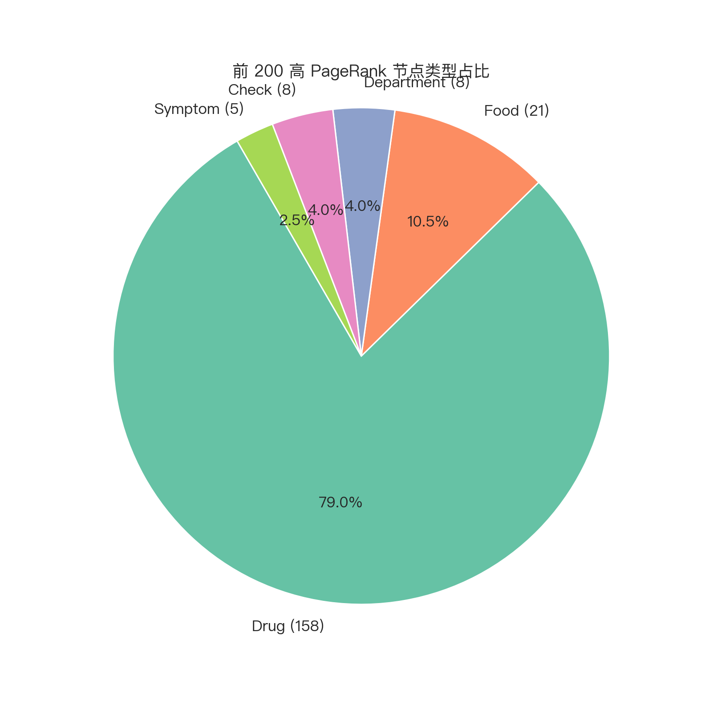
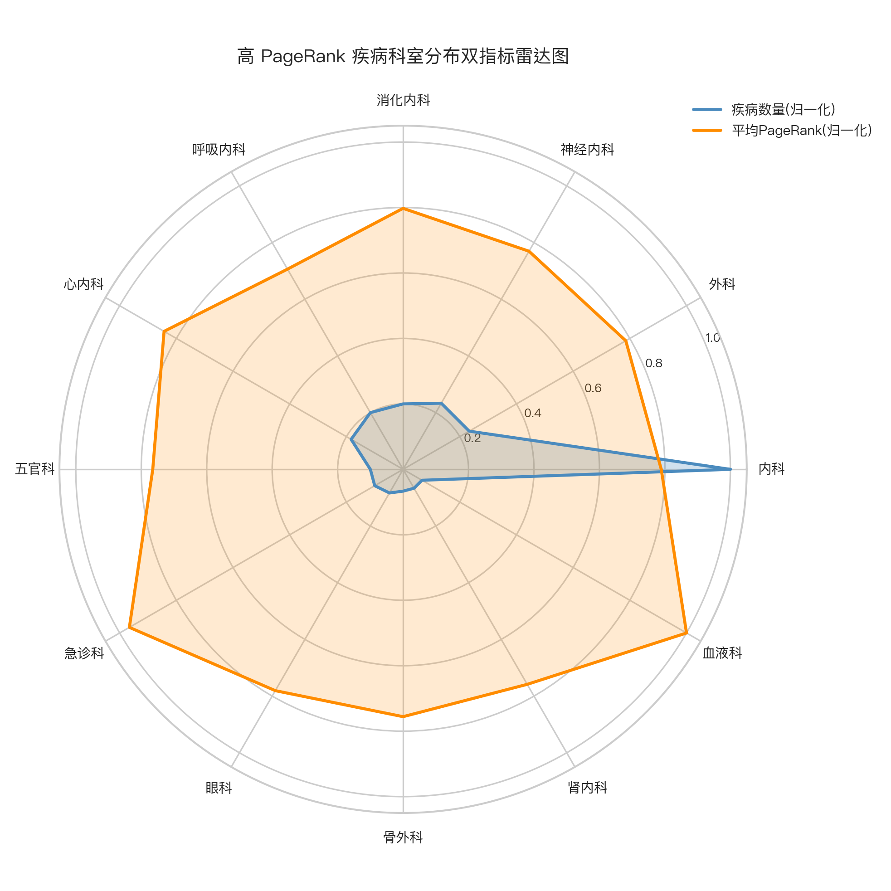
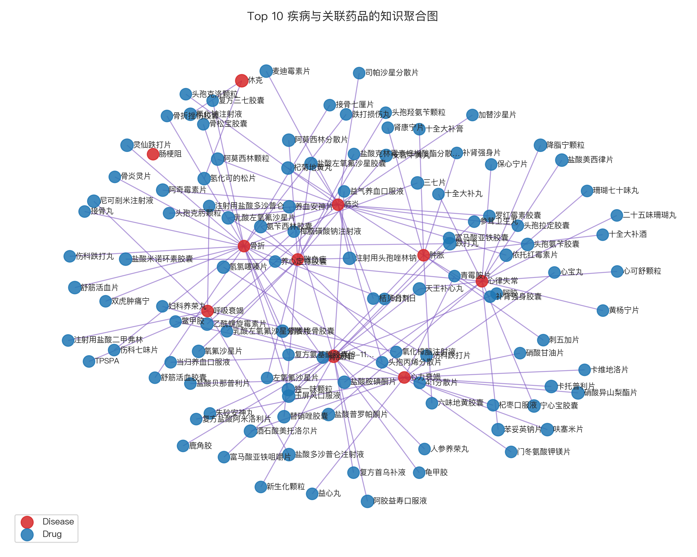

# PageRank 算法分析报告

**分析日期**: 2025年11月10日  
**数据集**: 医疗知识图谱 (PageRank分析)
**分析工具**: NetworkX + Python

---

## 一、PageRank 算法概览

PageRank 是一种衡量网络中节点“全局重要性”的算法。一个节点的 PageRank 分数高，意味着有更多、更重要的节点指向它。在医疗知识图谱中，高 PageRank 节点可以被理解为整个知识体系中的“核心概念”或“关键枢纽”。

### 1.1 核心数据
- **分析的节点总数**: 44,112
- **Top 1 PageRank 节点**: 内科 (Score: 1.16e-03)
- **Top 10 平均 PageRank 分数**: 8.99e-04

---

## 二、全局重要性分析

### 2.1 PageRank 分数分布

#### 业务解读
该图展示了所有节点 PageRank 分数的分布情况，呈现出典型的“长尾分布”特征。

**结构洞察**：
- **少数核心，多数边缘**：图中左侧的“高峰”表明，绝大多数节点的 PageRank 分数都非常低，而右侧拖着一条长长的“尾巴”，说明只有极少数节点的 PageRank 分数非常高。
- **符合复杂网络特性**：这种分布是无标度网络（Scale-free Network）的典型特征，意味着网络依赖于少数核心节点来维持其连接性。这与 `graph_analysis` 中发现的幂律分布结论一致。

### 2.2 Top 200 核心节点类型占比

#### 业务解读
上图展示了 PageRank 分数最高的200个节点的实体类型构成。

**数据观察**：
- **疾病和症状是绝对核心**：超过一半的核心节点是**疾病(Disease)**和**症状(Symptom)**。这完全符合直觉：疾病和症状是整个医疗知识体系的组织核心，绝大多数信息（如药物、检查、饮食）都是围绕它们展开的。
- **药物(Drug)和检查(Check)是重要补充**：作为治疗和诊断的关键手段，药物和检查也占据了相当大的比重，是连接疾病知识的重要桥梁。

---

## 三、核心疾病与科室分析

### 3.1 Top 20 核心疾病排名

#### 业务解读
此图表展示了 PageRank 最高的前20种疾病，并按其所属的临床系统（如循环系统、呼吸系统等）进行了颜色编码。

**数据观察**：
- **常见病和多发病占据高位**：排名靠前的多为大众熟知的疾病，如“高血压”、“糖尿病”等。这些疾病关联的知识（药物、并发症、饮食建议）非常丰富，因此在网络中具有极高的中心性。
- **系统性疾病的重要性**：图例清晰地展示了不同临床系统的疾病分布，有助于我们从更高维度理解疾病的重要性格局。

### 3.2 核心疾病的科室分布雷达图

#### 业务解读
雷达图从两个维度分析了与高 PageRank 疾病关联最紧密的临床科室：
1.  **疾病数量（蓝色）**：某科室关联的高 PageRank 疾病越多，其覆盖面越广。
2.  **平均PageRank（橙色）**：某科室关联的疾病平均重要性越高，其专业领域的“核心度”越强。

**数据观察**：
- **内外妇儿是基础**：内科、外科、妇产科、儿科等基础科室覆盖的疾病数量最多，是知识图谱的“广度”担当。
- **专科领域显现核心价值**：某些专科（如心血管内科、肿瘤科）虽然覆盖的疾病数量不一定最多，但其关联疾病的平均 PageRank 可能非常高，说明它们是“深度”和“专业核心”的代表。

---

## 四、核心疾病的关联网络

#### 业务解读
上图构建了一个连接网络，展示了 PageRank 最高的10种疾病（红色节点）以及与它们直接关联的药物（蓝色节点）。节点的大小反映了其自身的 PageRank 分数。

**数据观察**：
- **核心疾病连接共通药物**：我们可以看到，一些核心药物（较大的蓝色节点）同时被多种核心疾病所连接，这揭示了“一药多用”或治疗相关疾病的普遍性。
- **网络统计**：该网络共包含 **10** 种核心疾病，关联了 **111** 种药物，形成了 **116** 条连接关系。

**应用建议**：
- **智能问答与推荐**：基于此网络，可以构建更智能的推荐系统。例如，当用户查询某个核心疾病时，可以优先推荐与它关联且自身 PageRank 也很高的药物。
- **知识发现**：分析那些连接了多个不同系统疾病的药物，可能有助于发现新的治疗方案或研究方向。